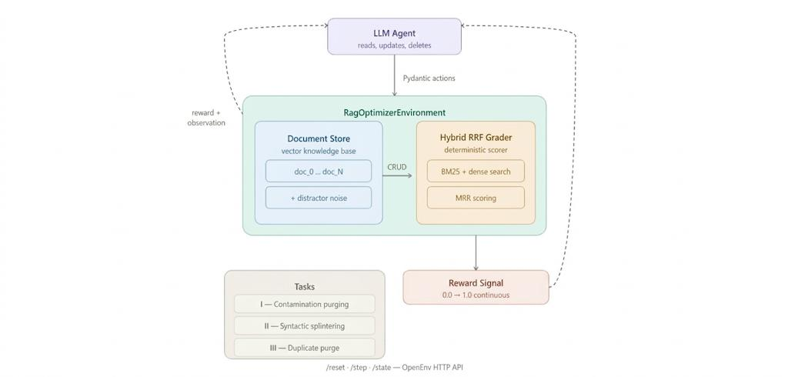

<br>

<p align="center">
  
  
  
  
  
  
</p>
<br>

<h1 align="center">RagOptimizerEnv</h1>
<p align="center">
  A high-fidelity Reinforcement Learning environment modeling the complex dynamics of enterprise Knowledge Base curation. LLM-driven agents must iteratively optimize, chunk, and groom raw document structures to natively improve vector-search retrieval accuracy over a continuous continuous state space.
  <br />
</p>

<br>

## System Architecture & Theme

**DATA ENGINEERING & AI INFRASTRUCTURE**

RagOptimizerEnv simulates the critical and computationally intensive role of an AI Data Engineer. The environment forces an autonomous agent to resolve conflicting semantic documentation, heuristically deduplicate incident reports, and structurally splinter monolithic text corpora to prevent embedding decay within a hybrid Retrieval-Augmented Generation (RAG) pipeline.

<br>
<p align="center">
  
</p>
<br>

## The Engineering Problem

A pervasive engineering bottleneck in deployed RAG systems is **embedding decay caused by underlying data swamps**. A corpus containing overlapping legacy documentation, unstructured support tickets, and bloated monolithic manuals causes downstream deterministic embedding models to suffer from severe multi-collinearity and contextual wash-out.

To resolve this, human data engineers must navigate the database, read dense architectural texts, deduce semantic boundaries, and execute targeted CRUD operations to optimize the topological search space. Simulating and automating this workflow poses a multi-hop, highly contextual reinforcement learning challenge that strictly tests an agent's reasoning bounds, context retention, and operational planning over long task trajectories.

## The Proposed Solution

## The Proposed Solution

We present an OpenEnv RL environment featuring an embedded, deterministic continuous Grader. The environment vectorizes the current database state after every single agent action using a Hybrid Search architecture (BM25 + Dense Semantic Embeddings). This provides a continuous reward density mapping—grading the agent purely on whether its structural operations inherently improved the theoretical Rank Fusion metrics of a downstream retrieval pipeline.

---

## Technical Novelty

- **Hybrid Reciprocal Rank Fusion (RRF) Grader:** Rather than relying on sparse terminal rewards or outdated TF-IDF vectors, the environment evaluates the topological space using state-of-the-art hybrid search. It fuses sparse BM25 arrays with deep semantic `SentenceTransformer` vectors, scoring the agent purely on genuine retrieval improvements (Mean Reciprocal Rank).
- **Topological State Feedback:** The environment streams a live topological representation of the knowledge base schema back to the agent on every interaction. Providing the `doc_id` indices mapped to character `length` and structural `metadata` ensures that agents operate efficiently without hallucinating system state across long inference contexts.
- **Dynamic Noise Mitigation:** The target corpus is embedded within an array of generated distractor documents designed to mathematically dilute the TF-IDF search space, testing the robust operational precision of deployed LLM agents.
- **Multi-Step Deductive Curriculum:** Sub-tasks require agents to temporarily retain the historical context of prior operations to successfully coordinate complex restructurings, pushing agents beyond single-shot function calling.

---

## Table of Contents

1. [Environment Abstractions](#1-environment-abstractions)
2. [Action & Observation Theory](#2-action--observation-theory)
3. [The Grader & Reward Analytics](#3-the-grader--reward-analytics)
4. [Curriculum Topologies](#4-curriculum-topologies)
5. [Inference Baseline Sandbox](#5-inference-baseline-sandbox)
6. [Containerized Deployment](#6-containerized-deployment)

---

## 1. Environment Abstractions

RagOptimizerEnv is an **OpenEnv** benchmark environment. Built atop stable microservice interfaces (`/reset`, `/step`, `/state`), it natively conforms to robust distributed training paradigms for Policy Gradient reinforcement algorithms.

**Complexity Vectors:**
- The underlying corpus intentionally mirrors unstructured enterprise deployments. 
- Actions compound natively. Wiping an incorrect document permanently alters the topological alignment of the search algorithm.
- Frontier agents are challenged to execute a non-trivial "discover, contextualize, execute, verify" loop under a rigid step budget.

---

## 2. Action & Observation Theory

### Action Abstraction (`RagOptimizerAction`)

Agents manipulate the embedding search space via a strictly defined remote schema:

| Action Primitive | Arguments | Effect Profile |
|---|---|---|
| `read_document` | `doc_id` | Fetches the specific byte-buffer into the context string without impacting reward density. |
| `update_document` | `doc_id`, `text` | Hard-overwrites existant node structures, or instantiates a fresh target node to achieve semantic splintering. |
| `delete_document` | `doc_id` | Destructively isolates and purges contradictory embeddings from the similarity array. |
| `add_metadata` | `doc_id`, `metadata_key`, `metadata_value` | Injects structured ontological markers to deterministically force embedding activations. |
| `submit` | None | Terminates the operational trajectory. |

### Feedback Space (`RagOptimizerObservation`)

Pydantic-typed JSON states returned immediately upon trajectory execution:
1. `message`: Terminal I/O logs, error stack-traces, or `read_document` raw buffers.
2. `current_docs`: A hierarchical mapping of the existing document index payload ensuring contextual grounding.
3. `reward`: The live theoretical model convergence rate formulated between `0.01` and `0.99`.

---

## 3. The Grader & Reward Analytics

Evaluation is robust, empirical, and mathematically bounded:

1. **State Mutation:** The agent executes a CRUD transaction within the topological space.
2. **Re-Embedding:** The environment calculates real-time `SentenceTransformer` dense vectors and `BM25Okapi` sparse arrays for the mutated corpus.
3. **Validation Probes:** The internal testing suite embeds an array of control queries targeting defined semantic concepts.
4. **Retrieval Benchmark:** Sparse `cosine_similarity` calculates the topological displacement.
5. **Score Allocation:** A hit is awarded conditionally if the modified Knowledge Base successfully forces the `target_concept` vector upward into the search indices.

**Reward Yield:** The Grader calculates a **Mean Reciprocal Rank (MRR)** score. For each control query, it finds the rank (1st, 2nd, 30th) of the document containing the target concept and scores it as `1/rank`. The final reward is the average MRR minus a cumulative step-cost penalty (**-0.01 per action step**), strictly bounded between `0.01` and `0.99`. This forces the agent to optimize efficiency: mechanically moving a correct document from rank 10 to rank 2 grants a measurable math reward, but taking 50 steps to figure it out will severely decay the final score.

### Practical RAG FAQ (Important Clarifications)

These are fantastic questions, and they cut right to the core of how real-world RAG systems operate.

#### 1. If we just send the KB summary, is it just metadata optimization?
Not exactly. While the agent sees the summary by default, it also has the `read_document` action.

- When the agent uses `read_document("doc_monolithic")`, the environment returns the entire raw text of that document in the `message` field of the next observation.
- The agent can read the text, identify that it is noisy or overloaded across multiple topics, and then use `update_document` to split or rewrite content into cleaner chunks.
- This means the benchmark supports true content optimization, not just metadata operations.

#### 2. Doesn't sending the entire KB to the embedding model blow up its context window?
No. The grader does not send the entire KB as one giant prompt.

- Embedding models operate per document, not as one monolithic concatenated input.
- The environment encodes each document individually into vectors, then stores those vectors in an index-like structure for retrieval scoring.
- Query-time evaluation compares a query vector against document vectors. It does not require processing the full KB in one context window.

#### 3. Is the result just fetching the right document, not the exact answer?
Exactly. This environment evaluates retrieval quality, the "R" in RAG.

- If retrieval is wrong, generation quality collapses and hallucination risk rises.
- The grader checks whether documents containing the target concept are ranked near the top for each control query.
- Optimizing document quality, structure, and noise levels pushes the clean source document toward rank 1, enabling downstream generators to answer correctly.

In practice, this environment trains an agent to behave like a retrieval-focused KB operator: maintain high signal quality so the retriever does not fail under noisy enterprise conditions.

---

## 4. Task Difficulty Levels

The environment tests agents across three progressively demanding task distributions mirroring production RAG degradation scenarios.

### Easy: Conflict Resolution
**The Vector Issue:** The base contains heavily overlapping parameters (competing versions of legacy and modern timeline protocols).
**System Goal:** Autonomously survey the semantic differences, deduce the temporal conflict, and execute `delete_document` sweeps to purge vector hallucination triggers.

### Level II: Syntactic Splintering
**The Vector Issue:** Extreme embedding decay caused by disparate conceptual structures compacted under a single referential document. This represents the well-known "PDF chunk wash-out" phenomenon.
**System Goal:** Methodically `read` the extensive parent block, temporarily cache the semantic context limits, and utilize rapid consecutive `update_document` calls to mechanically splinter and redistribute the knowledge logic across multiple fine-grained nodes.

### Level III: Duplicate Purge
**The Vector Issue:** The KB contains overlapping FastAPI routing docs where legacy `@app.route()` guidance competes against the correct current `@app.get()` / `@app.post()` pattern with Pydantic v2.
**System Goal:** Deduplicate legacy routing docs so retrieval consistently ranks the correct current routing reference at #1.

### Level III: Duplicate Purge
**The Vector Issue:** The KB contains overlapping FastAPI routing docs where legacy `@app.route()` guidance competes against the correct current `@app.get()` / `@app.post()` pattern with Pydantic v2.
**System Goal:** Deduplicate legacy routing docs so retrieval consistently ranks the correct current routing reference at #1.

---

## 5. Dataset Generation & Provenance

In modern AI benchmark design, the origin of test data is paramount. The isolated baseline dictionary (`kb_seed.json`) is not pulled from raw internet scrapes, but is instead **synthetically engineered** using LLMs specifically for this benchmark. 

- **Zero Data Leakage:** Synthesizing the data natively ensures that the exact target strings and topological traps cannot be accidentally memorized by frontier models during their pre-training phase on standard Wikipedia/GitHub scrapes.
- **Vocabulary Mirroring (Adversarial Noise):** The distractors injected into each task level are purposefully generated to utilize the exact same specialized terms (e.g., *API Key*, *CSS*, *Lehman Brothers*) as the correct resolution documents. This mathematical noise ceiling brutally exposes agents relying purely on lexical keyword matching.
- **Real-World Dimensionality:** The conceptual tasks (Tech Documentation, IT Outage Post-Mortems, Historical Financial Crises) were hand-selected to replicate the exact structural dimensions of real enterprise knowledge swamps.

---

## 6. Inference Baseline Sandbox

The root tree provides `inference.py`, a reference baseline executing an OpenAI-compliant autonomous data-engineering agent. 

### Persistent Reflexion Memory
The baseline agent features a persistent learning loop. If the agent fails a mission (e.g., getting stuck in a noisy semantic local minima), it evaluates its own trajectory and writes a **reflexion lesson** into `memory/lessons_learned.json`. In future episodes, this lesson is dynamically injected into the agent's system prompt, mimicking a human data engineer learning the unique topological constraints of the local Knowledge Base over time.

Telemetry formats strictly adhere to high-velocity logging required for large-scale evaluation pipelines:

```text
[START] task=rag_optimizer_env env=OpenEnv model=meta-llama/Meta-Llama-3.1-8B-Instruct
[STEP] step=1 action=read('doc_monolithic_onboarding') reward=0.33 done=false error=null
[STEP] step=2 action=update('doc_vpn_policy') reward=0.50 done=false error=null
...
[END] success=true steps=12 score=0.99 rewards=0.33,0.50,... 
```

### Execution
Ensure the environment contains an initialized `.env` matching standard model provider interfaces.
```bash
source env/bin/activate
python inference.py
```

---

## 6. Containerized Deployment

This architecture packages seamlessly into distributed environments utilizing strict Docker integrations for Hugging Face Spaces compatibility.

```bash
# Compile SDK Instance
docker build -f server/Dockerfile -t ragoptimizer:latest .

# Execute API Server Loop
docker run -p 8000:8000 ragoptimizer:latest
```

The primary instance binds over standard ASGI loops, broadcasting stable interfaces over standard HTTP routing (`/reset`, `/step`).
