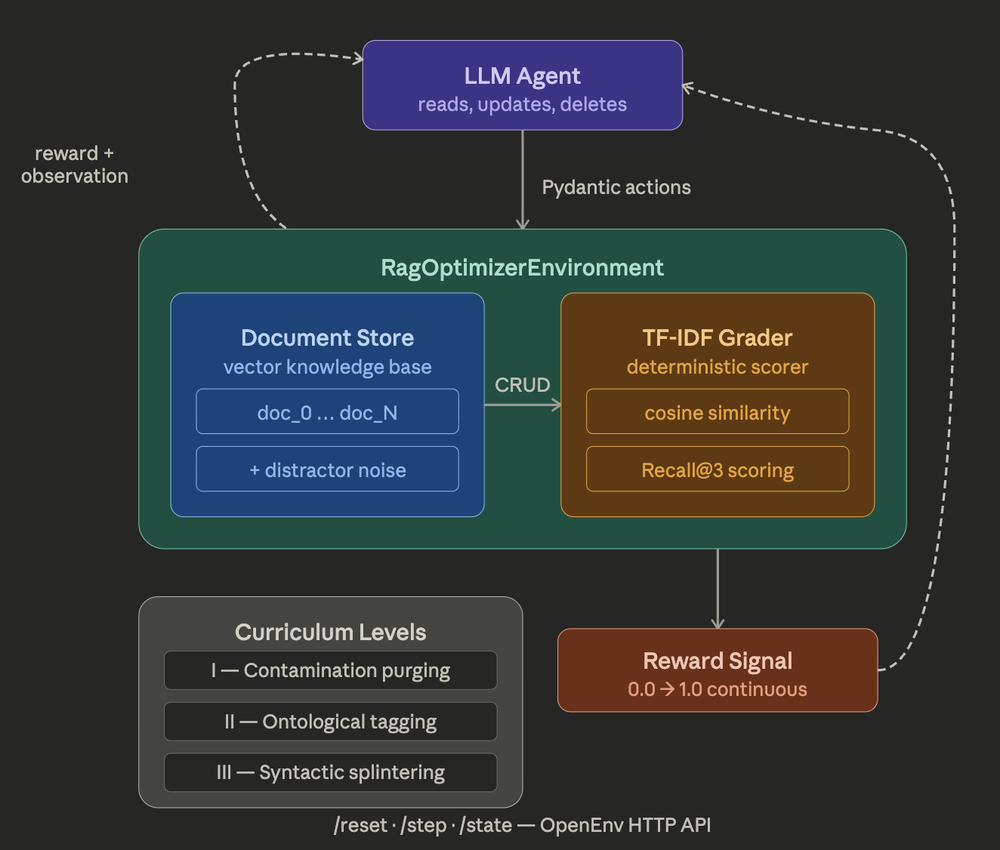

<br>

<p align="center">
  
  
  
  
  
  
</p>
<br>

<h1 align="center">RagOptimizerEnv</h1>
<p align="center">
  A high-fidelity Reinforcement Learning environment modeling the complex dynamics of enterprise Knowledge Base curation. LLM-driven agents must iteratively optimize, chunk, and groom raw document structures to natively improve vector-search retrieval accuracy over a continuous continuous state space.
  <br />
</p>

<br>

## System Architecture & Theme

**DATA ENGINEERING & AI INFRASTRUCTURE**

<br>
<p align="center">
  
</p>
<br>
## The Engineering Problem

A pervasive engineering bottleneck in deployed RAG systems is **embedding decay caused by underlying data swamps**. A corpus containing overlapping legacy documentation, unstructured support tickets, and bloated monolithic manuals causes downstream deterministic embedding models to suffer from severe multi-collinearity and contextual wash-out.

To resolve this, human data engineers must navigate the database, read dense architectural texts, deduce semantic boundaries, and execute targeted CRUD operations to optimize the topological search space. Simulating and automating this workflow poses a multi-hop, highly contextual reinforcement learning challenge that strictly tests an agent's reasoning bounds, context retention, and operational planning over long task trajectories.

## The Proposed Solution

We present an OpenEnv RL environment featuring an embedded, deterministic `scikit-learn` continuous Grader. The environment vectorizes the current database state after every single agent action, evaluating the structural integrity of the Knowledge Base in real-time. This provides a continuous reward density mapping—grading the agent purely on whether its structural operations inherently improved the theoretical Recall@3 limit of a downstream similarity search algorithm.

---

## Technical Novelty

- **Continuous Deterministic Grader:** Rather than relying on sparse terminal rewards, the environment maintains a live embedded `TfidfVectorizer`. It continuously restructures its internal sparse embedding matrix on every action step, calculating the cosine-similarity of hidden semantic payloads to supply dynamic gradient signals.
- **Topological State Feedback:** The environment streams a live topological representation of the knowledge base schema back to the agent on every interaction. Providing the `doc_id` indices mapped to character `length` and structural `metadata` ensures that agents operate efficiently without hallucinating system state across long inference contexts.
- **Dynamic Noise Mitigation:** The target corpus is embedded within an array of generated distractor documents designed to mathematically dilute the TF-IDF search space, testing the robust operational precision of deployed LLM agents.
- **Multi-Step Deductive Curriculum:** Sub-tasks require agents to temporarily retain the historical context of prior operations to successfully coordinate complex restructurings, pushing agents beyond single-shot function calling.

---

## Table of Contents

1. [Environment Abstractions](#1-environment-abstractions)
2. [Action & Observation Theory](#2-action--observation-theory)
3. [The Grader & Reward Analytics](#3-the-grader--reward-analytics)
4. [Curriculum Topologies](#4-curriculum-topologies)
5. [Inference Baseline Sandbox](#5-inference-baseline-sandbox)
6. [Containerized Deployment](#6-containerized-deployment)

---

## 1. Environment Abstractions

RagOptimizerEnv is an **OpenEnv** benchmark environment. Built atop stable microservice interfaces (`/reset`, `/step`, `/state`), it natively conforms to robust distributed training paradigms for Policy Gradient reinforcement algorithms.

**Complexity Vectors:**
- The underlying corpus intentionally mirrors unstructured enterprise deployments. 
- Actions compound natively. Wiping an incorrect document permanently alters the topological alignment of the search algorithm.
- Frontier agents are challenged to execute a non-trivial "discover, contextualize, execute, verify" loop under a rigid step budget.

---

## 2. Action & Observation Theory

### Action Abstraction (`RagOptimizerAction`)

Agents manipulate the embedding search space via a strictly defined remote schema:

| Action Primitive | Arguments | Effect Profile |
|---|---|---|
| `read_document` | `doc_id` | Fetches the specific byte-buffer into the context string without impacting reward density. |
| `update_document` | `doc_id`, `text` | Hard-overwrites existant node structures, or instantiates a fresh target node to achieve semantic splintering. |
| `delete_document` | `doc_id` | Destructively isolates and purges contradictory embeddings from the similarity array. |
| `add_metadata` | `doc_id`, `metadata_key`, `metadata_value` | Injects structured ontological markers to deterministically force embedding activations. |
| `submit` | None | Terminates the operational trajectory. |

### Feedback Space (`RagOptimizerObservation`)

Pydantic-typed JSON states returned immediately upon trajectory execution:
1. `message`: Terminal I/O logs, error stack-traces, or `read_document` raw buffers.
2. `current_docs`: A hierarchical mapping of the existing document index payload ensuring contextual grounding.
3. `reward`: The live theoretical model convergence rate formulated between `0.0` and `1.0`.

---

## 3. The Grader & Reward Analytics

Evaluation is robust, empirical, and mathematically bounded:

1. **State Mutation:** The agent executes an array transaction within the topological space.
2. **Re-Embedding:** The environment abstracts the updated schema into a standard English-corpus `TfidfVectorizer`.
3. **Validation Probes:** The internal testing suite embeds an array of control queries targeting defined semantic concepts.
4. **Retrieval Benchmark:** Sparse `cosine_similarity` calculates the topological displacement.
5. **Score Allocation:** A hit is awarded conditionally if the modified Knowledge Base successfully forces the `target_concept` vector upward into the Top 3 search indices.

**Reward Yield:** `(Successful Vectors / Total Vector Payload)` providing high-density intermediate signals mapping continuously toward the `±1.0` upper bound.

---

## 4. Curriculum Topologies

The environment tests agents across three progressively demanding task distributions mirroring production RAG degradation scenarios.

### Level I: Contamination Purging
**The Vector Issue:** The base contains heavily overlapping parameters (competing versions of legacy and modern timeline protocols).
**System Goal:** Autonomously survey the semantic differences, deduce the temporal conflict, and execute `delete_document` sweeps to purge vector hallucination triggers.

### Level II: Ontological Tagging
**The Vector Issue:** Textual segments representing technical telemetry are too dense and sparse on specific categorical keywords, resulting in low coordinate density for deterministic algorithms.
**System Goal:** Execute inferential reading, deduce categorical bounds organically, and route exact programmatic `metadata` tags onto corresponding payloads to anchor the search vectors.

### Level III: Syntactic Splintering (The Monolith)
**The Vector Issue:** Extreme embedding decay caused by disparate conceptual structures compacted under a single referential document. This represents the well-known "PDF chunk wash-out" phenomenon.
**System Goal:** Methodically `read` the extensive parent block, temporarily cache the semantic context limits, and utilize rapid consecutive `update_document` calls to mechanically splinter and redistribute the knowledge logic across multiple fine-grained nodes.

---

## 5. Inference Baseline Sandbox

The root tree provides `inference.py`, a reference baseline executing an OpenAI-compliant autonomous data-engineering agent.

Telemetry formats strictly adhere to high-velocity logging required for large-scale evaluation pipelines:

```text
[START] task=rag_optimizer_env env=OpenEnv model=meta-llama/Meta-Llama-3.1-8B-Instruct
[STEP] step=1 action=read('doc_monolithic_onboarding') reward=0.33 done=false error=null
[STEP] step=2 action=update('doc_vpn_policy') reward=0.50 done=false error=null
...
[END] success=true steps=12 score=1.00 rewards=0.33,0.50,... 
```

### Execution
Ensure the environment contains an initialized `.env` matching standard model provider interfaces.
```bash
source env/bin/activate
python inference.py
```

---

## 6. Containerized Deployment

This architecture packages seamlessly into distributed environments utilizing strict Docker integrations for Hugging Face Spaces compatibility.

```bash
# Compile SDK Instance
docker build -f server/Dockerfile -t ragoptimizer:latest .

# Execute API Server Loop
docker run -p 8000:8000 ragoptimizer:latest
```

The primary instance binds over standard ASGI loops, broadcasting stable interfaces over standard HTTP routing (`/reset`, `/step`).
